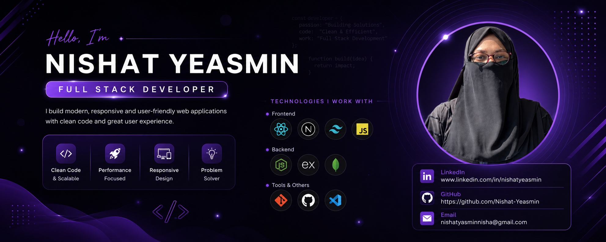

<h1 align="center">
Hi 👋, I'm Nishat Yeasmin
</h1>

<h3 align="center">
Full Stack Developer
</h3>

## 👩‍💻 About Me

I am a Computer Science student passionate about Full Stack developer.
I love building responsive and user-friendly applications.
I enjoy solving problems and learning new technologies.

## 🚀 Current Activities

- 🌱 Exploring Next.js and advanced React concepts.
- 💻 Developing full-stack applications with MongoDB, Express, React, and Node.js.
- 📚 Practicing Data Structures and Algorithms regularly.
- 🚀 Improving my GitHub profile and building a strong developer portfolio.

## 🛠️ Skills

### Frontend

### Backend

### Tools

<!-- ## 🌐 Connect With Me

 -->

## 🌐 Connect With Me

## 📊 GitHub Stats

 

  

